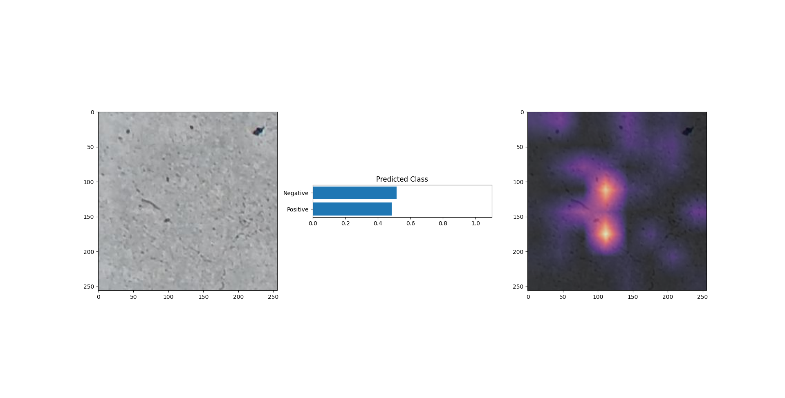

GradCAM implemention over ResNet50
Dataset : (SDNet2018) https://www.kaggle.com/datasets/harishmulchandani2/sdnet2018?resource=download
Reference : https://medium.com/the-owl/gradcam-in-pytorch-7b700caa79e5

Implemented Checkpoint Saving and Early Stopping

============== Classification Report ==============
              precision    recall  f1-score   support

           0       0.92      0.98      0.95       711
           1       0.89      0.68      0.77       197

    accuracy                           0.91       908
   macro avg       0.90      0.83      0.86       908
weighted avg       0.91      0.91      0.91       908

==================================================

